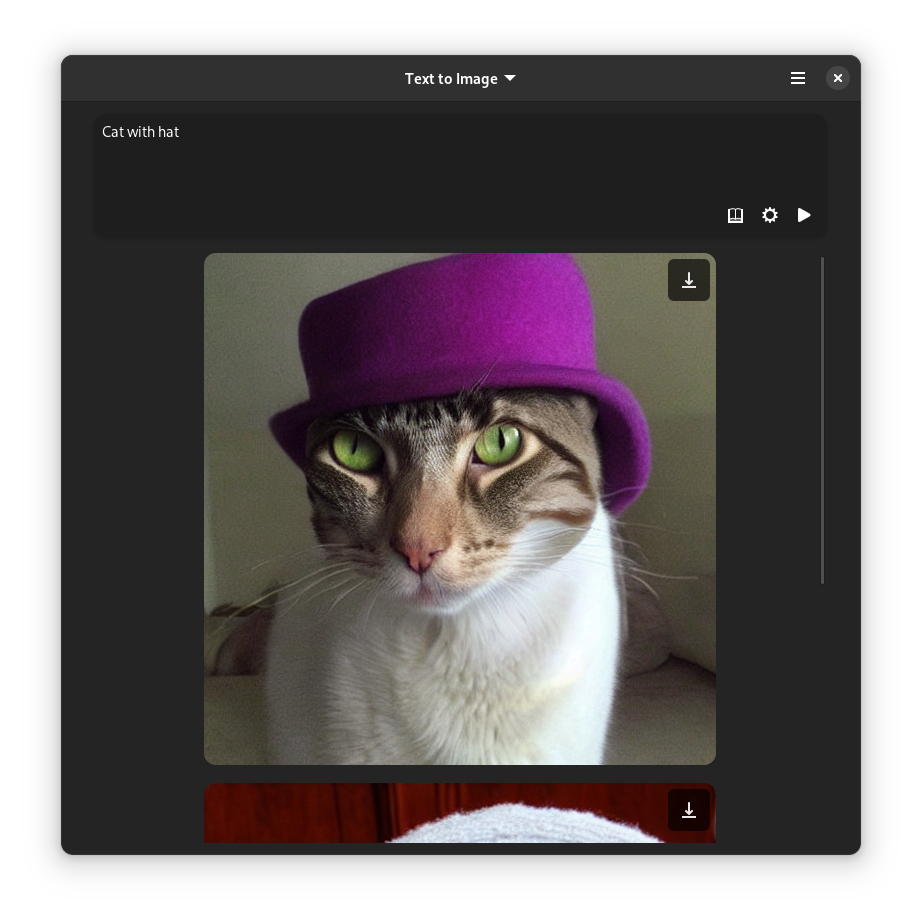

# Imagery

 

Imagery lets you generate images using [Stable Diffusion](https://github.com/Stability-AI/stablediffusion) based on text or image input.

Currently in development, see issues.

All images are currently saved in the cache folder of the Flatpak, i.e.: `/home/USER/.var/app/io.github.mpobaschnig.Imagery/cache`

# How to Build

Open GNOME Builder (or Visual Studio Code with Flatpak extension), and run it from there.
Manual building is not supported.

The models are downloaded within the app.

If somehow downloads are not working, you can download the models manually:

## Text to Image

Download the repository at `https://huggingface.co/runwayml/stable-diffusion-v1-5` and place it at `/home/USER/.var/app/io.github.mpobaschnig.Imagery/data/stable-diffusion-v1-5`
