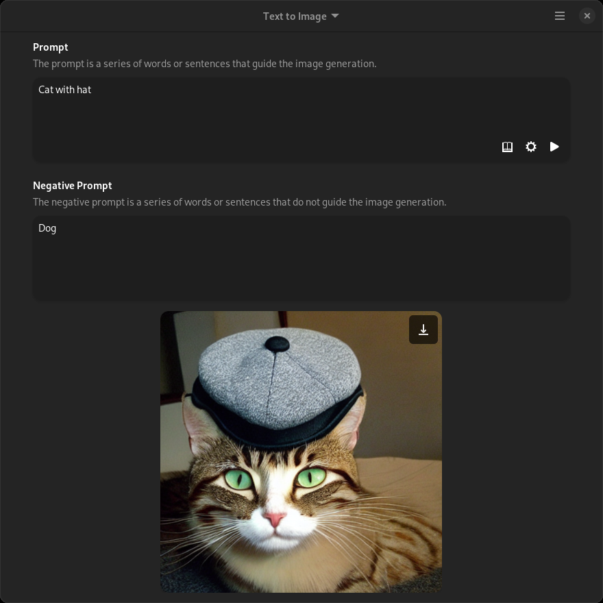

<h1 align="center">
   
  Imagery 
</h1>

<strong>Create images at will</strong>

 

 

 

Imagery lets you generate images using [Stable Diffusion](https://github.com/Stability-AI/stablediffusion) based on text or image input.

All generated images are saved in the cache folder, i.e.: `/home/USER/.var/app/io.github.mpobaschnig.Imagery/cache`

# How to build

Open GNOME Builder (or Visual Studio Code with the Flatpak extension), clone the repository, build and run it.

# Translations

Imagery is translated mainly using [Transifex](https://www.transifex.com/mpobaschnig/imagery/).
Translations over Github pull requests are also accepted, if you prefer to do so.
